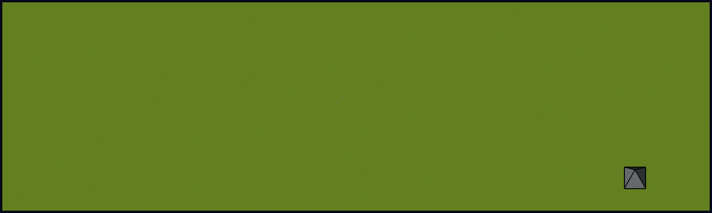
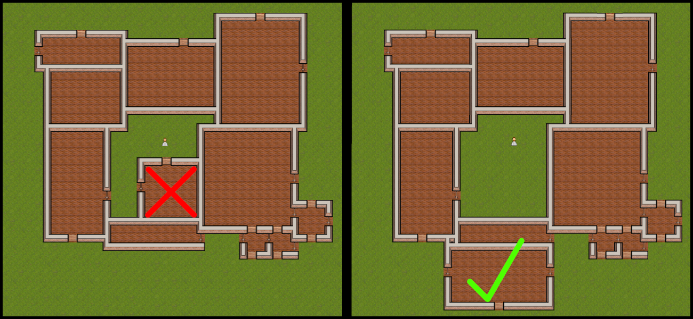

City Generation Algorithm
=====

It's a bottom-up algorithm that generates a city in a top-down tile-based world. It's bottom-up because given some simple rules, the city pattern *emerges* from an unorchestrated behavior.

I think that a bottom-up approach truly simulates what happens in a real settlement. Every person builds its own house without thinking too much about the urban planning.

# Definitions:
### The Outside
Given a tile belonging to *the outside* and a point outside of the map, there exists a path such that a character can walk from the first location to the second one without passing through doors or walls.

### Room
A rectangular area surrounded by a wall:
* No path exists to reach the end of the map without passing through doors or walls.

### Building
A set of adjacent rooms connected by doors with the following properties:
* Given two rooms belonging to the same building, there exists a path such that a character can walk from room A to room B without passing through *the outside*.
* Given two rooms belonging to different buildings, doesn't exist a path to walk from room A to room B without passing through *the outside*.

### Block
A set of adjacent buildings not separated by alleys or streets with the following properties:
* A building cannot belong to two different blocks at the same time.
* Given any two buildings belonging to different blocks, there exists a path such that the character can walk from building A to building B.
* Any room belonging to a block is at least two tiles away from any other room belonging to a different block.

# Algorithm

The algorithm mainly consists of two different actions:
* Expand an existing building (i.e. add a new room to an existing building);
* Build a new building (build the first room of the new building).

One of the two action is randomly taken.

## Expand an existing building:

These are the rules:
1. The block must not be full.
    
2. The new room must be adjacent to an existing room of the building.
    
3. The new room must not block the access to existing buildings in the block (i.e. cannot create a courtyard in which there is a building with no other access to *the outisde*). 
    
4. Among all the possible positions pick the one that maximizes the length of the wall shared with other rooms of that building.
    

## Build a new building:

The rules are:
1. The first room of the new building must be adjacent to an existing room of another building belonging to the same block.
    
2. The new building must not block the access to existing buildings in the block (i.e. cannot create a courtyard in which there is a building with no other access to *the outisde*). 
    
3. The new building must be accessible from outside, i.e. cannot be built in a courtyard completely surrounded by other buildings.
    
4. Among all the possible positions pick the one that  maximizes the length of the wall shared with rooms of other buildings belonging to the same block.
    
5. When a block is full, build the new building in a new block. 
    1. Build it maximizing the proximity to the buildings of an existing block.
    