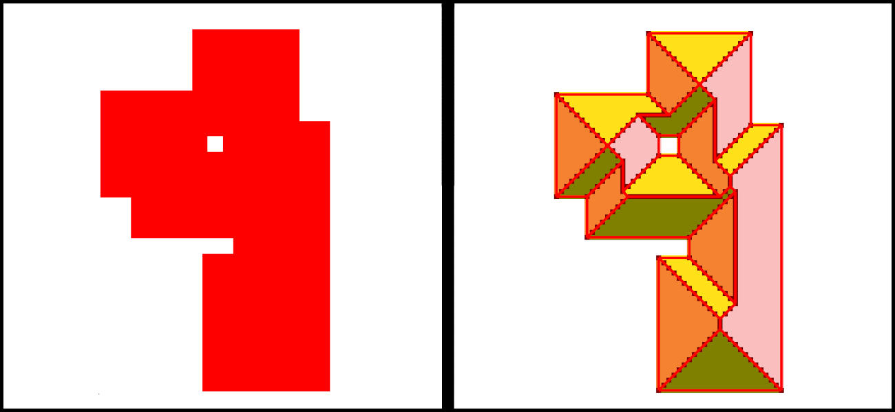
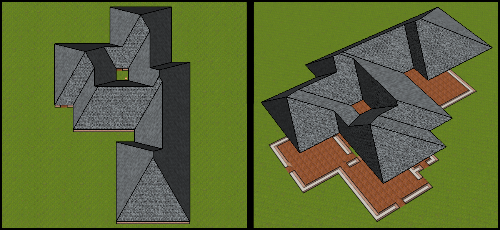
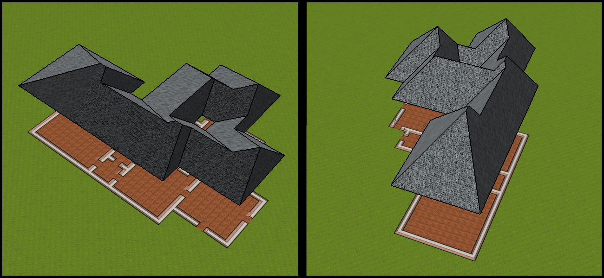
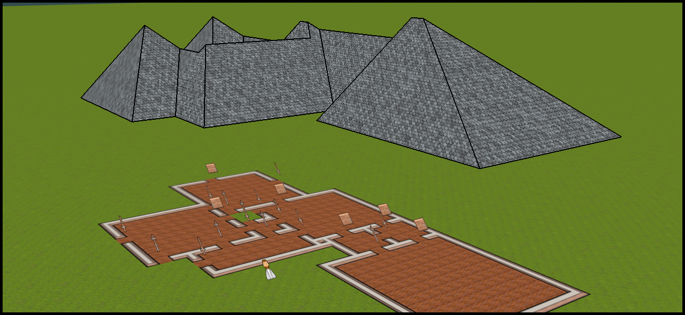

Roof Generation Algorithm
=====

It's an algorithm that, given any [connected shape](https://en.wikipedia.org/wiki/Connected_space) in a tile-based world, generates a 3D hip roof. 

It's complementary to the [City Generation Algorithm](../city_generation_algorithm/city_generation_algorithm.md).

## How it works

1. At first a heightmap is created using a numerical algorithm and then starting from the heightmap the polygons are identified.

    

2. Thereafter the polygons are triangulated and the optimal UVs are found. The angle of the height is tilted, moving the tips of the "pyramids" a bit northward.

    

    

    