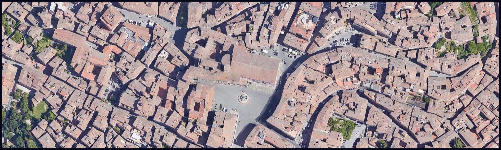
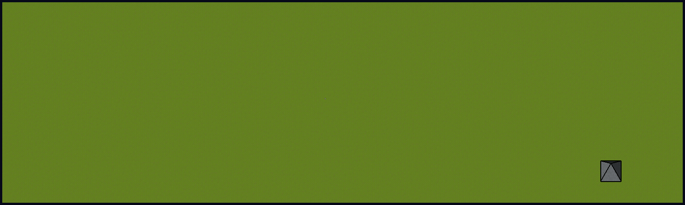

Evolving City Generation Demo
=====

Evolving City Generation is a demo showing a procedural generation algorithm to create a city in a top-down 2D tile-based world. 
* The purpose of the algorithm is to simulate the birth and the growth of a settlement that follows a spontaneous architecture pattern (for instance a medieval village, or a modern slum).
* The algorithm is intended to be real-time (even though it's not optimized yet).
* The demo also contains an algorithm to generate a 3D hip roof for any kind of tile-based shape.

This was an abandoned project developed between 2018 and 2019 with the main goal of learning 3D programming, OpenGL and shaders. I just added a tutorial and polished the code and the folder structure a bit.

## Algorithm Descriptions
* [City generation algorithm](doc/city_generation_algorithm/city_generation_algorithm.md).
* [Roof generation algorithm](doc/roof_generation_algorithm/roof_generation_algorithm.md).

## Download
The binaries are available on Itch.io.

## Dependencies
* OpenGL 4.3 implementation
* glad
* GLFW
* GLM
* Dear ImGui
* miniaudio
* stb
* Earcut
* FlatBuffers

## Supported Platforms
* Windows (MSVC)
* Linux (Clang/GCC)

## Engine Features
* Pixel perfect (for Zoom = 1).
* Support for multiple versions of the same texture, depending on the screen resolution (low-definition, HD, 4K).
* Support for custom tile dimensions.
* Automatic conversion of texture atlases in array textures (to avoid sprite bleeding at low mipmap levels).
* In-sprite anti-aliasing (through a technique involing alpha-to-coverage). This improves the graphics for zoom levels different than 1.
* Ability to round the movement of a character to the nearest pixel (for any zoom level). This improves the graphics, avoiding that a sprite texel is sampled half in a pixel and half in another pixel, and also avoiding the disturbing flickering that this would produce when the sampling isn't homogenous across frames.
* Edge-detection filter for 3D models.
* Support for splitting shaders in multiple files.
* GPU-based occlusion culling.
* Dev tools:
  * LOD coloration view mode.
  * Secondary windows to visually inspect off-screen framebuffers.

## Build from source

### Windows

With Powershell:

* Ensure to have the following tools installed:
  * git
  * CMake
  * Visual Studio with the following modules:
    * Desktop development with C++
        
1. Clone the repository with related submodules:

        git clone --recurse-submodules https://github.com/Tarquiscani/evolving-city-generation.git

2. Open the project folder: 

        cd evolving-city-generation

3. Create a new build folder:

        mkdir windows_build; cd windows_build

4. Generate the native build system:

        rm CMakeCache.txt; cmake -D MULTIPLE_CONFIGURATIONS=ON ..

5. Build:

        cmake --build .

6. Run the demo:

        cd .\Debug; .\demo_fullscreen_high_quality.exe

### Linux

Keep in mind that the following has been tested just on Ubuntu 20.04 LTS (native) and on Windows with WSL2 + Ubuntu.

1. Ensure to have the OpenGL package installed by running:

        sudo apt-get install freeglut3-dev

2. Ensure to have the xrandr package installed by running:

        sudo apt-get install xorg-dev libglu1-mesa-dev

3. (optional) Install clang 12:

        sudo apt install clang-12 --install-suggests
        sudo update-alternatives --install /usr/bin/cc cc /usr/bin/clang-12 100
        sudo update-alternatives --install /usr/bin/c++ c++ /usr/bin/clang++-12 100

4. Clone the repository and its submodules:

        git clone --recurse-submodules https://github.com/Tarquiscani/evolving-city-generation.git 

5. Open the project folder:

        cd evolving-city-generation

6. Create a new folder:

        mkdir linux_build && cd linux_build

7. Generate the native build system:

        rm CMakeCache.txt; cmake -D MULTIPLE_CONFIGURATIONS=ON ..

8. Build:

        cmake --build .

9. Run the demo:

        ./demo_fullscreen_high_quality